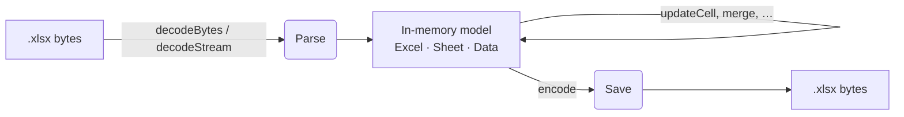

# How Kexcel Works

An `.xlsx` file is a **ZIP archive of XML parts**. Kexcel reads it into an
in-memory object graph, lets you mutate that graph, then serializes it back into a
ZIP. Understanding this pipeline helps explain the API's shape.



Two third-party, pure-Kotlin libraries do the heavy lifting:

- **`no.synth:kmp-zip`** — ZIP archive I/O.
- **`com.fleeksoft.ksoup`** — XML parsing and DOM.

## `Excel` is the document state

The [`Excel`](../../api/index.html) instance *is* the mutable document. It holds:

- the parsed XML documents (`xmlFiles`),
- the `Sheet` objects (`sheetMap`),
- the shared-string pool, and
- the style / font / border / number-format tables.

All sheet-level operations (`updateCell`, `insertRow`, `merge`, `findAndReplace`,
`copy`, `rename`, `delete`, …) are methods on `Excel` that delegate to the relevant
`Sheet`.

## A three-stage pipeline

Each stage owns a package in the source tree.

### 1. Parse (read path) — `parser/`

Constructed in `Excel`'s `init` block, the parser walks the archive in order:

```
[Content_Types].xml → workbook relationships → styles.xml
    → sharedStrings.xml → each worksheet → merged cells
```

It populates the `Excel` object's maps and builds `Sheet` instances.

### 2. Model / edit — `sheet/`

A `Sheet` stores cells as a nested `Map<row, Map<col, Data>>`. Each cell's value
is a `CellValue` (see [Reading & Writing Cells](../guides/reading-and-writing.md))
plus an optional `CellStyle` (which references a `FontStyle`, a `BorderSet`, and a
number format). `CellIndex` converts between `"A3"` strings and 0-based
`(column, row)` coordinates.

This is the layer you interact with. Sheets can be linked or cloned; `Sheet.clone`
gives an independent copy.

### 3. Save (write path) — `save/`

`encode()` runs `Save`/`SaveFile`, which mutate the ksoup XML documents to reflect
the current model, then re-zip everything into a `ByteArray`.

## Supporting packages

| Package | Responsibility |
| --- | --- |
| `archive/` | the ZIP/stream abstraction both parse and save build on |
| `shared_strings/` | the workbook's deduplicated string pool |
| `number_format/` | number/date/time format types and the format registry |
| `utils/` | coordinate/color conversion, enums, and constants |

## Design consequence: read and write stay symmetric

The recurring pattern when the library grows is:

1. extend the `Sheet` / `CellValue` model,
2. teach the **parser** to read the corresponding XML on load, and
3. teach **save** to emit it.

The read and write paths must mirror each other — anything the parser can read,
save must be able to write back.

## Why "in memory"?

Because parsing and saving both operate on byte arrays and an in-memory DOM, the
library has **no dependency on a filesystem**. That's what lets the exact same code
run on the JVM, Android and iOS — you supply bytes in, you get bytes out, and
platform-specific file handling stays in your app. See
[Saving & Loading](../guides/saving.md).
